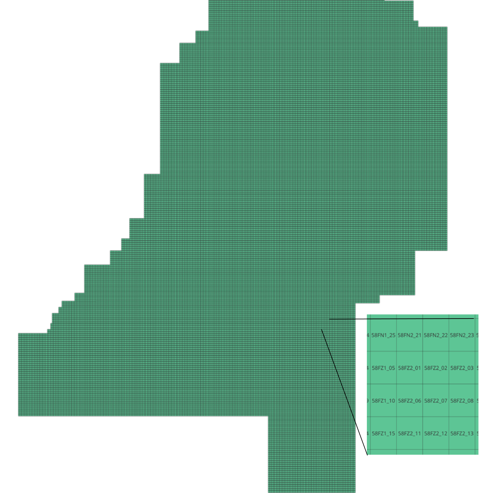

src.j\_dataprep.geotiles
================================
In this dictory the geojson and shapefile of the `GeoTiles <https://geotiles.citg.tudelft.nl/>`_ tiles index is stored. These are used for looking up which .LAZ tiles to download for the CHM creation, by using the bounds.
The source for the tiles: https://weblog.fwrite.org/kaartbladen/#geotiles

   The tile look-up file